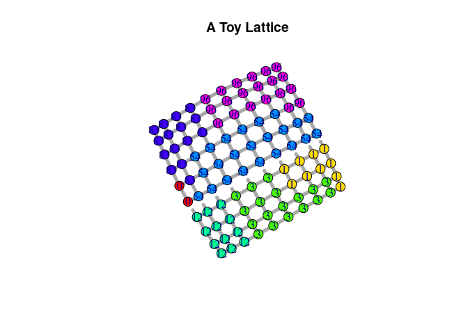
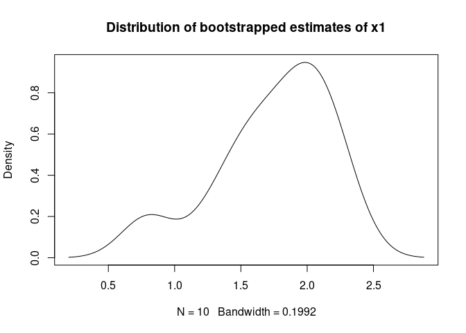

# pspm: Probabilistic Spatial Partition Model

## Introduction

This packages contains a series of functions and classes to set up and
fit a Probabilistic Spatial Partition Model and sample partitionings
following the the methodology introduced by Müller-Crepon, Schvitz and
Cederman (2023). In short, the model is based on a simplification of
continuous geographic space as a (planar) graph. The observed
partitioning is encoded on the graphs’ vertices such that each vertex is
a member of one and only one partition. The graphs partitioning is
modeled as the result of *attractive* and *repulsive* force active on
its edges which affect the probability that the vertices they connect
belong to the same or to different partitions. The model allows to
estimate the effects of edge-elvel attributes on the
repulsion/attraction between vertices, thus estimating their impact on
the overall partitioning of the graph.

Please refer to the original publication for all technical details
beyond the summary provided below. It can be found [here]() and as
ungated version
[here](http://www.carlmueller-crepon.org/publication/state_shape/).

When using the pspm package, please cite:

Müller-Crepon, Carl, Guy Schvitz, Lars-Erik Cederman (2023). Shaping
States into Nations: The Effects of Ethnic Geography on State Borders.
*American Journal of Political Science*, conditionally accepted for
publication.

## The model

We model the distribution over all possible partitionings $P$ of lattice
$G$ as a Boltzmann distribution:

``` math
Pr(P = p_{i}) =  {e^{-\epsilon_{i}}\over\displaystyle\sum_{i = 1}^{|\mathbb{P}|}e^{-\epsilon_{i}} }
```

here, a partitioning $i$’s chance of realization decreases with its
energy $\epsilon_i$. The energy of a partitioning is defined as the sum
of energies on the graph’s edges that run between nodes $j$ and $k$
where $j$ and $k$ are located in the same partition ($s_{j,k} = 1$).
Edges energies are not realized where $j$ and $k$ do not belong to the
same partition ($s_{j,k} = 0$):

``` math
\epsilon_{i} = \displaystyle\sum_{j,k \in L}\, \epsilon_{j,k}\,s_{j,k}
```

Potential and realized edge-level energies are in turn affected by a
constant ($\beta_0$) and a set of edge-level attributes
$\textbf{x}_{j,k}$ that are weighted by a parameter vector $\beta$

``` math
\epsilon_{j,k} = \beta_0 + \beta\, \textbf{x}_{j,k}
```

The empirical goal of the PSPM is it to estimate parameters $\beta_0$
and $\beta$ from observed data. To that intent, the PSPM uses a maximum
composite likelihood approach. Uncertainty estimates can be derived via
a parametric bootstrap that samples partitionings with a given set of
$\beta_0$ and $\beta$ parameters and then fits the model on the sampled
partitionings.

## Installation

You can directly download and install the pspm package from GitHub.
Before doing so, please make sure that you have
[Python3](https://www.python.org/downloads/) installed. Upon
installation, the package automatically installs necessary python
dependencies via the
[reticulate](https://cran.r-project.org/web/packages/reticulate/index.html)
R-package.

``` r
library(devtools)
install_github(repo = "carl-mc/pspm")
```

## Getting started

the pspm package heavily builds on the igraph library which is used to
handle the underlying netowrk data and allows user-friendly data
manipulation. Since random sampling plays an important role during
sampling, it is recommended to set a random seed in R and python.
`pspm_set_seed()` achieves just that.

``` r
# Packages
library(pspm)
library(igraph)

# Set seeds in R and python
pspm_set_seed(1)
```

## Setting up a toy lattice

To illustrate the model. we first set up a toy lattice – as a `PSPM`
object – with 100 nodes arranges on a 10-by-10 grid. The lattice encodes
two edge-level characteristics that separate one side of the lattice
from the other – think of a river or mountain range. The distribution of
one of these attributes is shown as dotted vs. straight edges on the
graph below. Both attributes exert *repulsive* forces (`beta = c(2,1)`).
Furthermore, the vertices are attracted to each other by a baseline
constant of -2. We sample a partitioning of the lattice with a burn-in
period of 10 rounds.

``` r
# Make mock PSPM Object with a sampled partitioning
sl <- generate_grid_data(N_sqrd = 10, ## 10 x 10 lattice
                        beta0 = -2, ## Negative constant = baseline attraction between nodes
                        beta = c(2,1), ## Include two repulsive edge-level predictors
                        dep_structure = "von_neumann", ## Each node connects to 4 neighbors
                        burnin = 10 ## Sample with a 10 burn-in periods
                        )

# Print class of object
print(class(sl))
```

    ## [1] "PSPM" "R6"

``` r
# Plot PSPM object
sl$plot_partitioning(edge_predictor = 1, 
                     edge.width = 5, vertex.size = 10,
                     main = "A Toy Lattice")
```

<!-- -->

## PSPM to igraph conversion

The `PSPM` object created above can be transformed into an `igraph`
object and vice-versa using the following methods:

``` r
# Transform PSPM to igraph
graph <- PSPM2igraph(sl)

# Transfers data as edge- and vertex-attributes
edge_attr_names(graph)
```

    ## [1] "x1" "x2"

``` r
vertex_attr_names(graph)
```

    ## [1] "X1" "Y"

``` r
# Transform igraph back to PSPM
sl.from.g <- igraph2PSPM(g = graph, 
                         outcome_name = "Y",
                         edge_pred_names = c("x1", "x2"))
```

## Fitting a PSPM Model

Finally, we can fit the PSPM to estimate the effect of the edge-level
attributes on the partitioning of the lattice. The function
`fit_pspm_model()` provides a wrapper around lower-level functions and
classes, allowing the user to estimate the model directly from an
`igraph` object with a formula where the left-handside variable Y refers
to the vertex attribute that encodes vertices partition members and the
right-handside variables referring to edge-level predictors. Multiple
graphs can be passed to the function at the same time such that one
model is fit across them. Once a model is fit, `bootstrap_pspm()` allows
for carrying out a (parallelized) parametric bootstrap.

``` r
## The easy way

### Estimate
m.simple <- fit_pspm_model(formula = Y ~ x1 + x2, 
                           g_ls = list(graph),
                           return_pspm = TRUE)

### Bootstrap CIs
bs.simple <- bootstrap_pspm(m.simple,
                            n_boot_iter = 10, ## Should be > 100
                            burnin = 10, ## Could be higher, depending on complexite of graph and model
                            cl = 10L, ## Number of CPUs for parallelization
                            return_sims = TRUE, ## Return full distribution of estimates
                            ci_level = .95)
```

    ## [1] "Load Learn Object on cluster"
    ## [1] "Run Bootstrap"

``` r
### Summary
summary(m.simple)
```

    ## --------------------------------------------
    ## Maximum Likelihood estimation
    ## BFGS maximization, 31 iterations
    ## Return code 0: successful convergence 
    ## Log-Likelihood: -13.44675 
    ## 3  free parameters
    ## Estimates:
    ##          Estimate Std. error t value  Pr(> t)    
    ## Constant  -2.5097     0.5919  -4.240 2.23e-05 ***
    ## x1         1.9450     1.8374   1.059    0.290    
    ## x2         0.4492     0.9306   0.483    0.629    
    ## ---
    ## Signif. codes:  0 '***' 0.001 '**' 0.01 '*' 0.05 '.' 0.1 ' ' 1
    ## --------------------------------------------

``` r
print(bs.simple$ci_mat)
```

    ##            Constant        x1         x2
    ## LB_Basic -3.3369735 1.6394587 -0.6487487
    ## UB_Basic -0.8817648 2.9760757  2.3140127
    ## LB_Perc  -4.1375785 0.9139855 -1.4156026
    ## UB_Perc  -1.6823697 2.2506025  1.5471588

``` r
plot(density(bs.simple$beta_boot[,"x1"]),
     main = "Distribution of bootstrapped estimates of x1")
```

<!-- -->

For completeness, the following code shows the same estimation process
using the lower-level classes and functions in the PSPM package. We
first have to transform our `PSPM` object into a `PSPMLearn` object,
which include the `fit_composite_log_likelihood()` method. Once the
`PSPMLearn` object is fitted, it can be directly bootstrapped using the
appropriate method. Note that this method does not automatically handle
missing data and other intricacies, such as keeping track of variable
names.

``` r
## The complicated way (inside the wrapper)

### Initiate PSPMLearn Object
learn_obj <- PSPMLearn$new(list(sl.from.g))

### Fit
m.compl <- learn_obj$fit_composite_log_likelihood(beta_init = c(0,0,0))

### Bootstrap
bs.compl <- learn_obj$par_bootstrap_composite_log_likelihood(n_boot_iter = 10, burnin = 10,
                                                 cl = 10L, return_sims = FALSE, ci_level = .95)
```

    ## [1] "Load Learn Object on cluster"
    ## [1] "Run Bootstrap"

``` r
### Summary
summary(m.compl)
```

    ## --------------------------------------------
    ## Maximum Likelihood estimation
    ## BFGS maximization, 31 iterations
    ## Return code 0: successful convergence 
    ## Log-Likelihood: -13.44675 
    ## 3  free parameters
    ## Estimates:
    ##      Estimate Std. error t value  Pr(> t)    
    ## [1,]  -2.5097     0.5919  -4.240 2.23e-05 ***
    ## [2,]   1.9450     1.8374   1.059    0.290    
    ## [3,]   0.4492     0.9306   0.483    0.629    
    ## ---
    ## Signif. codes:  0 '***' 0.001 '**' 0.01 '*' 0.05 '.' 0.1 ' ' 1
    ## --------------------------------------------

``` r
print(bs.compl)
```

    ##            Constant        x1         x2
    ## LB_Basic -3.3369735 1.6394587 -0.6487487
    ## UB_Basic -0.8817648 2.9760757  2.3140127
    ## LB_Perc  -4.1375785 0.9139855 -1.4156026
    ## UB_Perc  -1.6823697 2.2506025  1.5471588

## Producing nice tables

Finally, models fitted with `fit_pspm_model()` and the
(`maxLik`)\[<https://cran.r-project.org/web/packages/maxLik/index.html>\]
methods used under the hood can be printed as text, html, or latex files
using a slight extension of the
(texreg)\[<https://cran.r-project.org/web/packages/texreg/texreg.pdf>\]
package.

``` r
# Integration with texreg
pspm2table(list(m.simple),
           # bootci = list(bs.simple$ci_mat), boottype = "percentile",
           type = "text", add.stats = c("Edges" = "N_edges", "Vertices" = "N"))
```

    ## 
    ## ==========================
    ##                 Model 1   
    ## --------------------------
    ## Constant         -2.51 ***
    ##                  (0.59)   
    ## x1                1.95    
    ##                  (1.84)   
    ## x2                0.45    
    ##                  (0.93)   
    ## --------------------------
    ## Edges           180       
    ## Vertices        100       
    ## Log-Likelihood  -13.45    
    ## Num. obs.       100       
    ## ==========================
    ## *** p < 0.01; ** p < 0.05; * p < 0.1

## Feedback, comments, questions

We are very grateful for any bug reports, feedback, questions, or
contributions to this package. Please report any issues here or write to
c.a.muller-crepon \[at\] lse.ac.uk .
