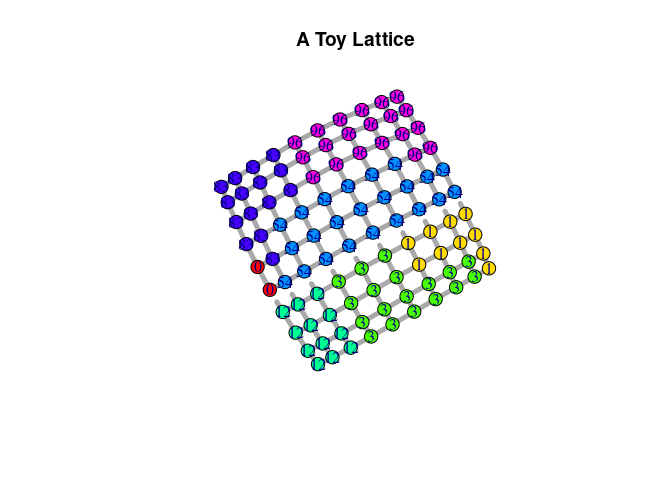
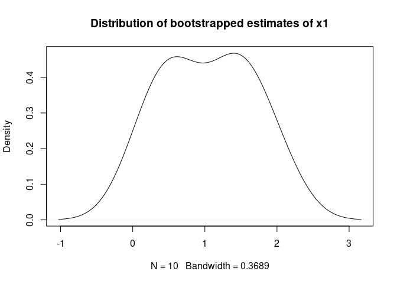

# pspm: Probabilistic Spatial Partition Model

When using the pspm package, please cite:

Müller-Crepon, Carl, Guy Schvitz, Lars-Erik Cederman (2023). Shaping
States into Nations: The Effects of Ethnic Geography on State Borders.
*American Journal of Political Science*, conditionally accepted for
publication.

## Installation

You can directly download and install the pspm package from GitHub.
Before doing so, please make sure that you have
[Python3](https://www.python.org/downloads/) installed. Upon
installation, the package automatically installs necessary python
dependencies via the
[reticulate](https://cran.r-project.org/web/packages/reticulate/index.html)
R-package.

    library(devtools)
    install_github(repo = "carl-mc/pspm")

## Getting started

    # Packages
    library(pspm)
    library(igraph)

    ## 
    ## Attaching package: 'igraph'

    ## The following objects are masked from 'package:stats':
    ## 
    ##     decompose, spectrum

    ## The following object is masked from 'package:base':
    ## 
    ##     union

    # Set seeds in R and python
    pspm_set_seed(1)

## Handling a toy lattice

    # Make mock PSPM Object with a sampled partitioning
    sl <- generate_grid_data(N_sqrd = 10, ## 10 x 10 lattice
                            beta0 = -2, ## Negative constant = baseline attraction between nodes
                            beta = c(2,1), ## Include two repulsive edge-level predictors
                            dep_structure = "von_neumann", ## Each node connects to 4 neighbors
                            burnin = 10 ## Sample with a 10 burn-in periods
                            )
    sl$plot_partitioning(edge_predictor = 1, 
                         edge.width = 5, vertex.size = 10,
                         main = "A Toy Lattice")

    # Transform PSPM to igraph
    graph <- PSPM2igraph(sl)
    edge_attr_names(graph)

    ## [1] "x1" "x2"

    vertex_attr_names(graph)

    ## [1] "X1" "Y"

    # Transform igraph back to PSPM
    sl.from.g <- igraph2PSPM(g = graph, outcome_name = "Y",
                             edge_pred_names = c("x1", "x2"))

## Fitting a PSPM Model

    ## The easy way

    ### Estimate
    m.simple <- fit_pspm_model(formula = Y ~ x1 + x2, 
                               g_ls = list(graph),
                               return_pspm = TRUE)

    ### Bootstrap CIs
    bs.simple <- bootstrap_pspm(m.simple, 
                                n_boot_iter = 10, ## Should be > 100
                                burnin = 10, ## Could be higher, depending on complexite of graph and model
                                cl = 10L, ## Number of CPUs for parallelization
                                return_sims = TRUE, ## Return full distribution of estimates
                                ci_level = .95)

    ## [1] "Load Learn Object on cluster"
    ## [1] "Run Bootstrap"

    ### Summary
    summary(m.simple)

    ## --------------------------------------------
    ## Maximum Likelihood estimation
    ## BFGS maximization, 31 iterations
    ## Return code 0: successful convergence 
    ## Log-Likelihood: -13.44675 
    ## 3  free parameters
    ## Estimates:
    ##          Estimate Std. error t value  Pr(> t)    
    ## Constant  -2.5097     0.5919  -4.240 2.23e-05 ***
    ## x1         1.9450     1.8374   1.059    0.290    
    ## x2         0.4492     0.9306   0.483    0.629    
    ## ---
    ## Signif. codes:  0 '***' 0.001 '**' 0.01 '*' 0.05 '.' 0.1 ' ' 1
    ## --------------------------------------------

    print(bs.simple$ci_mat)

    ##            Constant        x1         x2
    ## LB_Basic -3.3369735 1.6394587 -0.6487487
    ## UB_Basic -0.8817648 2.9760757  2.3140127
    ## LB_Perc  -4.1375785 0.9139855 -1.4156026
    ## UB_Perc  -1.6823697 2.2506025  1.5471588

    plot(density(bs.simple$beta_boot[,"x1"]),
         main = "Distribution of bootstrapped estimates of x1")

    ## The complicated way (inside the wrapper)

    ### Initiate PSPMLearn Object
    learn_obj <- PSPMLearn$new(list(sl.from.g))

    ### Fit
    m.compl <- learn_obj$fit_composite_log_likelihood(beta_init = c(0,0,0))

    ### Bootstrap
    bs.compl <- learn_obj$par_bootstrap_composite_log_likelihood(n_boot_iter = 10, burnin = 10, 
                                                     cl = 10L, return_sims = FALSE, ci_level = .95)

    ## [1] "Load Learn Object on cluster"
    ## [1] "Run Bootstrap"

    ### Summary
    summary(m.compl)

    ## --------------------------------------------
    ## Maximum Likelihood estimation
    ## BFGS maximization, 31 iterations
    ## Return code 0: successful convergence 
    ## Log-Likelihood: -13.44675 
    ## 3  free parameters
    ## Estimates:
    ##      Estimate Std. error t value  Pr(> t)    
    ## [1,]  -2.5097     0.5919  -4.240 2.23e-05 ***
    ## [2,]   1.9450     1.8374   1.059    0.290    
    ## [3,]   0.4492     0.9306   0.483    0.629    
    ## ---
    ## Signif. codes:  0 '***' 0.001 '**' 0.01 '*' 0.05 '.' 0.1 ' ' 1
    ## --------------------------------------------

    print(bs.compl)

    ##            Constant        x1         x2
    ## LB_Basic -3.3369735 1.6394587 -0.6487487
    ## UB_Basic -0.8817648 2.9760757  2.3140127
    ## LB_Perc  -4.1375785 0.9139855 -1.4156026
    ## UB_Perc  -1.6823697 2.2506025  1.5471588

## Producing nice tables

    # Integration with texreg
    pspm2table(list(m.simple),
               bootci = list(bs.simple$ci_mat), boottype = "percentile",
               type = "text", add.stats = c("Edges" = "N_edges", "Vertices" = "N"))

    ## 
    ## ==============================
    ##                 Model 1       
    ## ------------------------------
    ## Constant         -2.51 *      
    ##                 [-4.14; -1.68]
    ## x1                1.95 *      
    ##                 [ 0.91;  2.25]
    ## x2                0.45        
    ##                 [-1.42;  1.55]
    ## ------------------------------
    ## Edges           180           
    ## Vertices        100           
    ## Log-Likelihood  -13.45        
    ## Num. obs.       100           
    ## ==============================
    ## * 0 outside the confidence interval.
